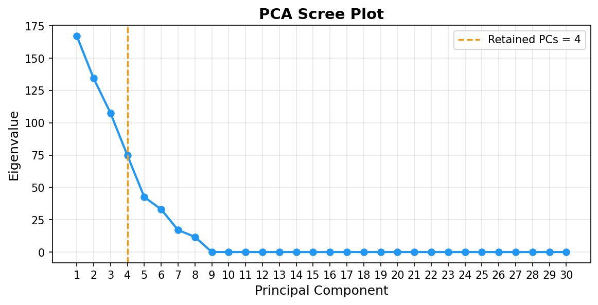
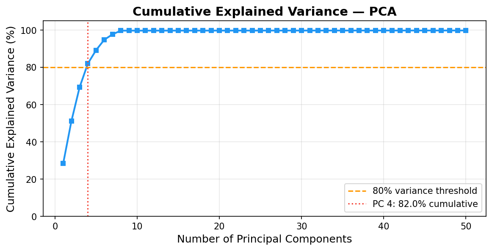
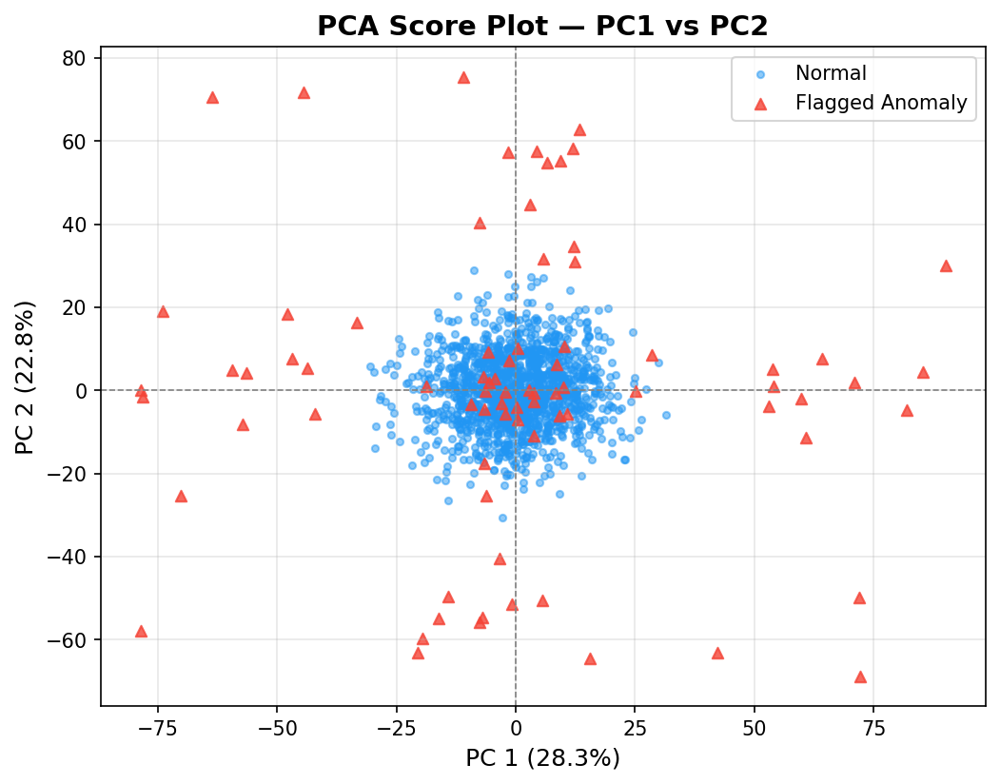
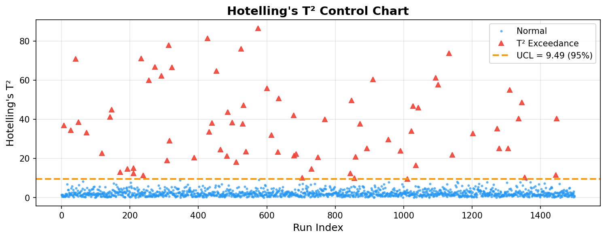
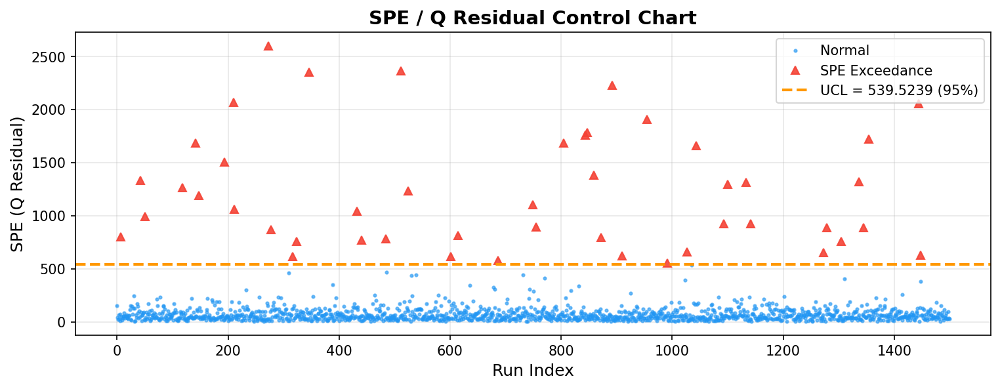

# Multivariate SPC for Semiconductor Manufacturing

**Statistical process control using PCA, Hotelling's T², and SPE residual monitoring on high-dimensional semiconductor process data.**

---

## Overview

Modern semiconductor fabrication lines generate hundreds of sensor readings per wafer run — chamber pressure, gas flow rates, RF power, temperature profiles, endpoint signals, and more. Monitoring each variable independently with univariate control charts is impractical and misses the correlated, multi-dimensional nature of process drift.

This project implements a **multivariate statistical process control (SPC)** pipeline that:

1. Loads a realistic synthetic dataset of **1,500 wafer runs × 590 process variables**
2. Standardizes all features to zero mean and unit variance
3. Applies **Principal Component Analysis (PCA)** to reduce dimensionality
4. Selects the minimum number of PCs capturing ≥80% of total process variance
5. Computes **Hotelling's T²** to detect deviations within the normal operating subspace
6. Computes **SPE (Q statistic)** to detect deviations outside the normal subspace
7. Flags anomalous wafer runs exceeding 95% confidence control limits
8. Generates a complete set of engineering-grade plots

---

## Background

### Why Multivariate SPC?

In a semiconductor fab, process variables are highly correlated — a shift in chamber pressure often co-varies with gas flow, temperature, and endpoint timing. Univariate SPC treats each variable independently and will either:
- Miss a real process excursion that manifests as a subtle, correlated shift across many variables, or
- Generate excessive false alarms by applying 590 independent control limits simultaneously.

Multivariate SPC solves this by monitoring the **joint distribution** of all variables.

### Why PCA?

PCA decomposes the original 590-dimensional space into a small number of orthogonal components that explain most of the process variance. This achieves:
- **Dimensionality reduction**: from 590 correlated variables to ~5 interpretable components
- **Decorrelation**: PCA scores are orthogonal, satisfying the independence assumption of T²
- **Noise separation**: residual (SPE) space captures deviations not explained by normal process variation

### Monitoring Statistics

| Statistic | What it detects | Control limit |
|-----------|----------------|---------------|
| **Hotelling's T²** | Abnormal variation *within* the retained PC subspace | χ² distribution, k dof |
| **SPE / Q residual** | Abnormal variation *outside* the retained PC subspace | Jackson-Mudholkar approximation |

A wafer run is flagged as a **process excursion** if it exceeds the upper control limit (UCL) of either statistic.

---

## Dataset

The dataset is synthetically generated for reproducibility:

| Property | Value |
|----------|-------|
| Observations | 1,500 wafer runs |
| Variables | 590 process/sensor variables (`sensor_001` … `sensor_590`) |
| Underlying structure | 8-factor latent model with decaying factor strengths |
| Injected anomalies | ~75 runs (~5%) with shifted latent factors simulating process excursions |
| Random seed | 42 |

> **Note:** The data is generated by `scripts/generate_data.py`. Run this script first before any other step. True anomaly labels are saved separately and are used only for post-hoc validation — they are not used in the detection algorithm.

---

## Project Structure

```
Multivariate-SPC-for-Semiconductor-Manufacturing/
├── README.md
├── requirements.txt
├── .gitignore
├── data/                        ← generated data (not committed)
├── scripts/
│   ├── generate_data.py         ← Step 1: generate synthetic dataset
│   ├── preprocess.py            ← Step 2: clean and standardize
│   ├── run_pca.py               ← Step 3: PCA decomposition
│   ├── compute_statistics.py    ← Step 4: T² and SPE computation
│   ├── plot_results.py          ← Step 5: generate all plots
│   └── utils.py                 ← shared helper functions
├── plots/                       ← output plots (PNG)
├── outputs/                     ← anomaly tables and statistics
└── report/
    ├── technical_report.md
```

---

## How to Run

### 1. Install dependencies

```bash
pip install -r requirements.txt
```

### 2. Run the full pipeline (from project root)

```bash
python scripts/generate_data.py
python scripts/preprocess.py
python scripts/run_pca.py
python scripts/compute_statistics.py
python scripts/plot_results.py
```

Each script prints progress and output paths. Run them in order.

### Expected outputs

| Location | Contents |
|----------|----------|
| `data/semiconductor_process_data.csv` | Raw synthetic dataset |
| `data/X_scaled.npy` | Standardized feature matrix |
| `data/pca_scores_ret.npy` | Scores on retained PCs |
| `outputs/anomaly_summary.csv` | Flagged runs with T² and SPE values |
| `plots/01_scree_plot.png` | Eigenvalue scree plot |
| `plots/02_cumulative_variance.png` | Cumulative explained variance |
| `plots/03_score_plot_pc1_pc2.png` | PC1 vs PC2 score plot |
| `plots/04_t2_control_chart.png` | Hotelling's T² control chart |
| `plots/05_spe_control_chart.png` | SPE control chart |
| `plots/06_anomaly_summary_bar.png` | Detection category summary |
| `plots/07_pairwise_pca.png` | Pairwise PC score plot |

---

## Key Results

| Metric | Value |
|--------|-------|
| PCA: variables retained | 4 PCs out of 590 |
| Cumulative variance captured | 82.0% |
| PC1 individual variance | 28.3% |
| PC2 individual variance | 22.8% |
| Injected anomalies | 75 runs |
| Flagged by T² | 75 runs |
| Flagged by SPE | 47 runs |
| Flagged by either statistic | 79 runs (5.3% of all observations) |
| False positive rate | ~5% — consistent with 95% UCL |

**Key finding:** T² and SPE are complementary — T² captures deviations within the normal process subspace while SPE catches a different class of excursions outside the model. Using both statistics together provides more complete anomaly coverage than either alone.

---

## Plots

| Plot | Description |
|------|-------------|
|  | Eigenvalue decay — identifies the natural dimensionality of the process |
|  | Component selection based on variance threshold |
|  | Separation of normal and anomalous runs in PC space |
|  | Run-by-run T² monitoring with UCL |
|  | Run-by-run SPE monitoring with UCL |

---

## References

- Wise, B.M. & Gallagher, N.B. (1996). *The process chemometrics approach to process monitoring and fault detection.* Journal of Process Control.
- Jackson, J.E. & Mudholkar, G.S. (1979). *Control procedures for residuals associated with principal component analysis.* Technometrics.
- Montgomery, D.C. (2012). *Introduction to Statistical Quality Control*, 7th ed. Wiley.

---

## Author

**Navyatha G**
Electrical Engineering — Iowa State University
GitHub: [navyathag13-ui](https://github.com/navyathag13-ui)
